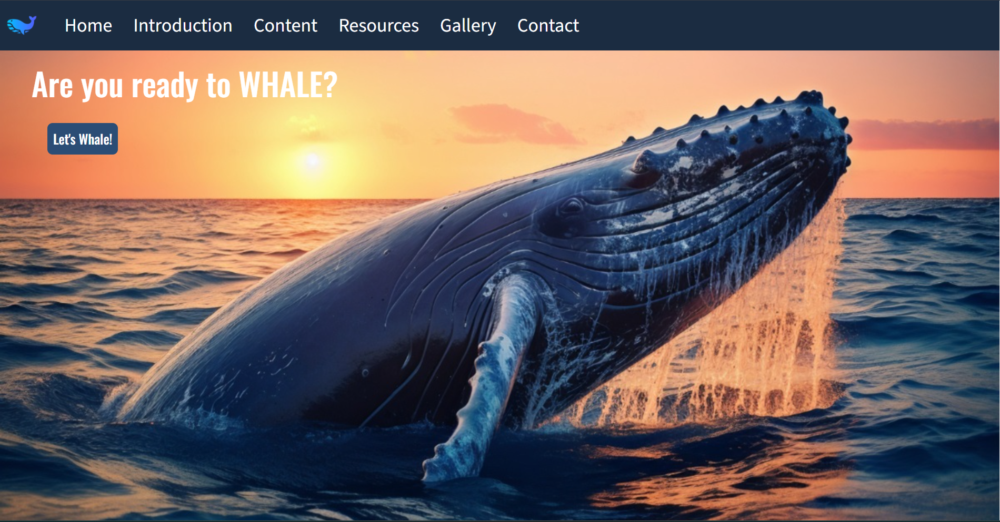
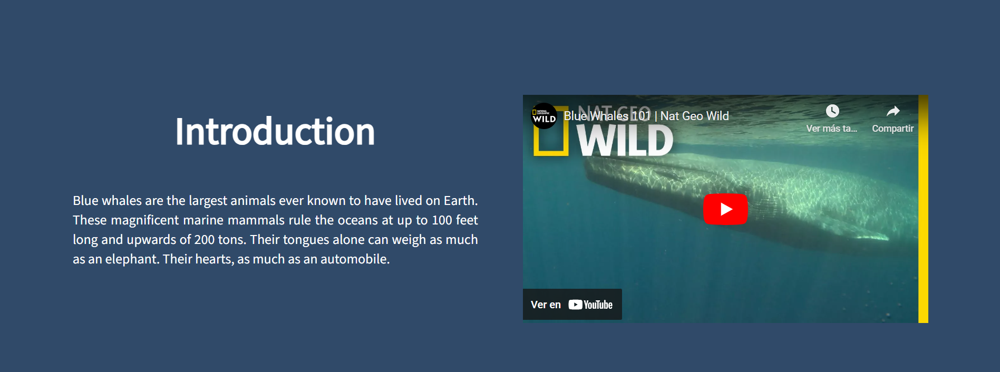
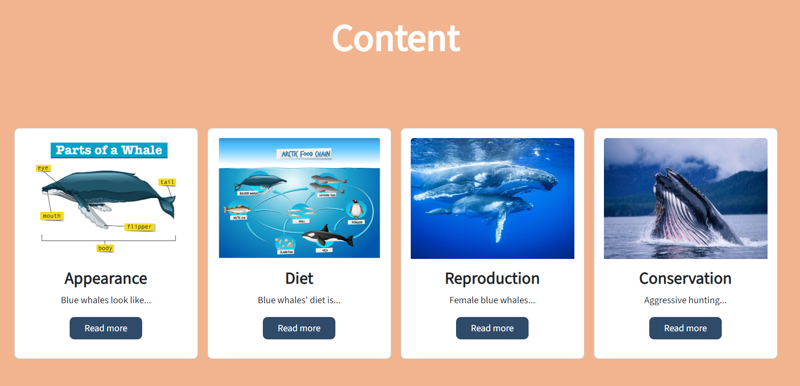
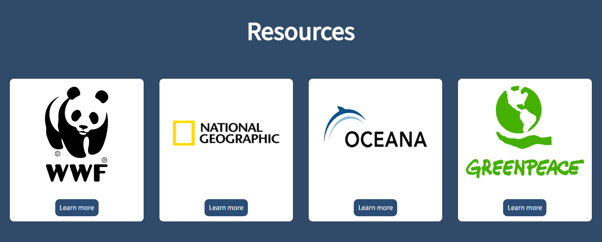
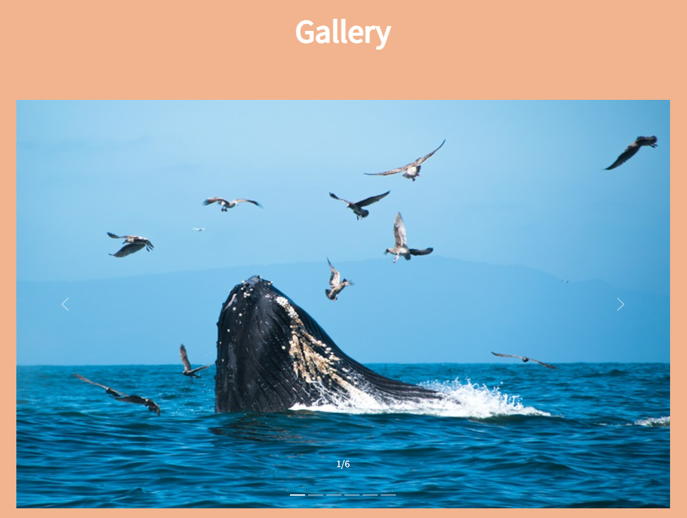
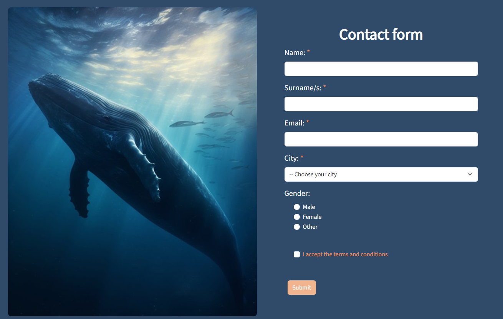
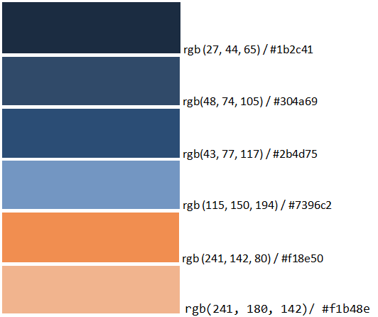

<h1>Memoria del proyecto Bootstrap de la 2º evaluación de Lenguajes de Marcas - 1º DAW</h1>
<h2>Whale with me</h2>
<h2>Índice</h2>
<ul>
  <li><a href="#introduccion">Introducción</a></li>
  <li><a href="#motivacion">Motivación</a></li>
  <li><a href="#estructura">Estructura</a></li>
  <li><a href="#estilo">Estilo</a></li>
</ul>

<h2 id="introduccion">Introducción</h2>

Trabajo realizado por: Ruyi Xia Ye

Proyecto Bootstrap v5.3 tomando como referencia el proyecto web "from scratch" de la 1ª evaluación de Lenguajes de Marcas - Whale with me

Febrero de 2024 

Licencia: uso educativo con atribución

<h2 id="motivacion">Motivación</h2>

He decidido escoger el proyecto de la 1ª evaluación de LM porque mi intención era poder practicar  
  las distintas funcionalidades de la herramienta Bootstrap más que centrarme en su diseño y estilo. 
  En este proyecto he usado las mismas imágenes de mi primer proyecto web, salvo en la sección de Contact form,  
  donde he añadido una imagen de más nueva.

<h2 id="estructura">Estructura</h2>

La web está dividida en 7 secciones:

<ul>
  <li>Hero Section</li>  
  <li>Introduction</li>
  <li>Content</li>
  <li>Resources</li>
  <li>Gallery</li>
  <li>Contact (Form)</li>
  <li>Footer</li>
</ul>

<h3>Hero Section</h3>

He utilizado una imagen de fondo tomada de Freepik que se adapta fácilmente a diferentes dispositivos partiendo desde un diseño mobile first. 
Sobre ella he colocado un Call to Action - "Let´s Whale" que he estilado tomando como referencia la guía de Bootstrap v5.3 
Luego lo he enlazado con la sección Introduction

<h3>Introduction</h3>

En esta sección he introducido un grid de 2 columnas - div.container>row>(div.col)*2: 

En la primera columna introduzco un párrafo de texto a modo introductorio al mundo de las ballenas azules.

En la segunda columna introduzco un vídeo de National Geographic sacado de Youtube a través de un link.

<h3>Content</h3>

En esta sección he introducido un grid de 4 columnas - div.container>row>(div.col)*4: 

En cada columna he introducido un div.card estilado y al que le he añadido una imagen y un Call to Action - "Read more".

En cada una de las cards he introducido un párrafo de texto muy corto explicando de qué va cada una.

<h3>Resources</h3>

En esta sección he introducido un grid de 4 columnas - div.container>row>(div.col)*4: 

En cada columna he introducido un div.card estilado y al que le he añadido una imagen y un Call to Action - "Learn more".

Si hago click en los botones Call to Action me llevan a cada una de las páginas web mostradas en la imagen de la card.

<h3>Gallery</h3>

He introducido una galería tipo slideshow o carousel estilado con la guía de Bootstrap v5.3.

La galería se compone de 6 imágenes sacadas de Freepik y Unsplash.

<h3>Contact form</h3>

He introducido una imagen y un formulario de contacto estilado con la guía de Bootstrap v5.3.

La imagen está sacada de Freepik.

<h3>Footer</h3>

Lo he dispuesto en un grid de 4 columnas: 

Primera columna: 

<ul>
  <li>Firma de la página web</li>  
  <li>Mensaje de bienvenida</li>
</ul>

Segunda columna: 

<ul>
  <li>Home</li>  
  <li>Introduction</li>
  <li>Content</li>
  <li>Resources</li>
  <li>Gallery</li>
</ul>

Tercera columna: 

<ul>
  <li>Follow us: introduzco los iconos de las redes sociales. </li>
  <li>Credits: al hacer click muestra una ventada modal donde aparecen todas las fuentes usadas para sacar la media de la landing page. </li>
</ul>

Cuarta columna: 

<ul>
  <li>Contact us: incluyo un email de contacto y un Call to Action - "Donate".</li>  
</ul>

<h2 id="estilo">Estilo de la página</h2>
<h3>Paleta de colores</h3>

Sin incluir las clases predefinidas de Bootstrap v5.3

<h3>Tipografías</h3>
<ul>
  <li>Oswald regular</li>  
  <li>SourceSans3 regular</li>
</ul>
<h3>Imágenes (Fuentes):</h3>
<ul>
  <li>Freepik</li>  
  <li>Unsplash</li>
  <li>Oceanaadventures.co.za</li>
  <li>Wallpapers.com</li>
  <li>National Geographic (logo only)</li>
  <li>WWF(logo only)</li>
  <li>Greenpeace (logo only)</li>
  <li>Oceana.org (logo only)</li>
</ul>
<h3>Videos</h3>

Intro video from Youtube - National Geographic <a href="https://youtu.be/bgiPTUy2RqI?si=t_d7_Hjced9KvPqE" target="_blank">link</a>

<h2 id="snippets">Code snippets</h2>

Tomadas de getbootstrap.com, usando la v5.3 de Bootstrap:

<ul>
  <li>Barra de navegación - <a href="https://getbootstrap.com/docs/5.3/components/navbar/#nav" target="_blank">link</a></li>
  <li>Galería - <a href="https://getbootstrap.com/docs/5.3/components/carousel/#events" target="_blank">link</a></li>
  <li>Modal box for Credits - <a href="https://getbootstrap.com/docs/5.3/components/modal/#how-it-works" target="_blank">link</a></li>
</ul>

